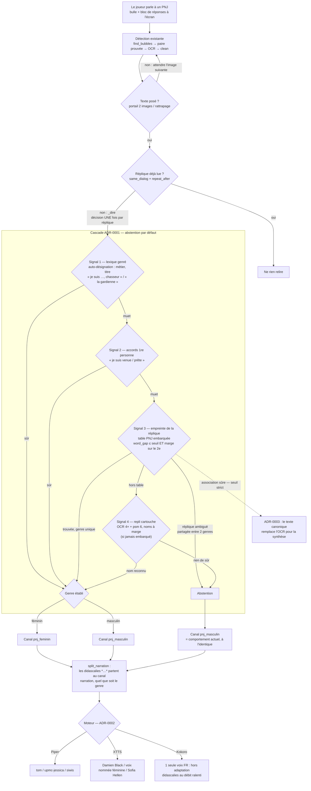

# ADR-0001 — Adapter la voix au genre du PNJ

- **Statut** : Proposé
- **Date** : 2026-08-03

## Contexte et problème

Tous les PNJ parlent aujourd'hui d'une même voix (Piper : `fr_FR-tom-medium`,
masculine), quel que soit le personnage à l'écran. Une chasseuse de
dragodindes et un forgeron de Brâkmar sonnent pareil : pour un outil dont le
but est de faire *entendre* le jeu, c'est une perte d'incarnation nette.

La détection du genre a déjà été tentée, et **abandonnée sur mesure, pas sur
intuition** (README, « Pas de détection du genre du PNJ » ;
`plans/moteur-xtts-et-genre.md`) :

- **OCR du cartouche de nom** : le parchemin doré rend « Klako » en `R ÉN A`,
  « Sotsiah Peh » en `n l C DR`. Ratios difflib au vrai nom : 0,11 à 0,24,
  quand un rapprochement fiable en demande 0,9. Une table nom → genre était
  donc inalimentable.
- **Accords dans le texte** : la détection en première personne fonctionne
  (« je suis venue », « je suis la gardienne ») et évite le piège « tu es
  venue » qui vise le joueur — mais aucun des quatre dialogues alors en
  fixture n'en contenait. Les PNJ disent « Je suis Klako, chasseur », où
  c'est le métier qui porte le genre, pas la grammaire.

Quatre choses ont changé depuis cette décision :

1. **Le registre de captures a grandi** : d'environ quatre dialogues à une
   trentaine de captures réelles versionnées (`tests/fixtures/dialogues/`,
   `themes/`, `echelle/`), couvrant dix thèmes et plusieurs échelles. C'est
   la base d'étalonnage (« samples ») sur laquelle toute détection doit être
   mesurée avant d'exister dans le code.
2. **Une recette d'OCR du cartouche existe** : FINDINGS.md documente que le
   nom sur parchemin sort lisible avec **upscale 4× + `--psm 6`**
   (« Sotsiah Peh » ressort dans `| Sotsiah Peh i`, bruit de bordure à
   nettoyer). Les ratios 0,11–0,24 mesurés au moment de l'abandon l'ont été
   sans ce prétraitement.
3. **Le rapprochement peut se faire sur vocabulaire fermé.** On ne cherche
   pas à *lire* le nom, mais à le *reconnaître* parmi une liste finie de PNJ
   connus. Sur vocabulaire fermé, le bon critère n'est pas un ratio absolu
   de 0,9 mais une **marge** : le meilleur candidat doit distancer nettement
   le deuxième. C'est plus tolérant au bruit d'OCR, et ça s'abstient de
   lui-même quand rien ne se détache.
4. **Le genre existe comme donnée structurée dans les données
   communautaires du jeu.** Vérifié le 2026-08-03 sur l'API DofusDB :
   `api.dofusdb.fr/npcs/<id>` rend, par PNJ, un champ `gender` (mesuré :
   Hazel Ementaire — un PNJ de nos propres fixtures — `gender: 1` ;
   Uk'Not'Allag', id 3223, `gender: 0`), le nom en français, le `look`
   (apparence) **et les textes de dialogue** (`dialogMessages`,
   `dialogReplies`). Il n'y a donc rien à *deviner* visuellement pour la
   masse des PNJ : le genre se lit dans les données ; toute la difficulté
   restante est d'identifier, au runtime, *quel* PNJ parle.

Le mot « genre » désigne ici le rendu vocal du personnage — voix masculine ou
féminine — tel que le jeu le présente (nom, titre, accords) : c'est la seule
chose qu'un synthétiseur peut restituer.

## Décision

Adapter la voix du PNJ à son genre quand — et seulement quand — un signal
sûr l'établit. **L'abstention est le comportement par défaut** : en
l'absence de signal, la voix reste celle d'aujourd'hui, à l'identique. Une
mauvaise voix est pire que pas d'adaptation ; le critère d'acceptation
l'encode (zéro erreur tolérée, la couverture est la variable d'ajustement).

Quatre signaux, du moins cher au plus cher, combinés en cascade :

1. **Lexique genré dans le texte de bulle** (déjà OCRisé, coût nul) :
   auto-désignations dont le français porte le genre — métiers et titres
   (« chasseur / chasseuse », « le gardien / la gardienne »), articles
   d'auto-présentation (« je suis *la* … »). Liste finie, versionnée,
   auditable. Les mots épicènes (« forgemage ») ne votent pas.
2. **Accords en première personne** (déjà écartés comme signal *principal*,
   gardés comme signal d'appoint) : « je suis venue », « je suis prête ».
   Rare mais sans ambiguïté quand il est là. Le piège « tu es venue » (qui
   accorde le *joueur*) reste exclu : seules les formes en « je » comptent.
3. **Empreinte du dialogue → table PNJ embarquée** (nouveau, coût d'une
   recherche de dictionnaire). La réplique elle-même identifie son PNJ :
   les données communautaires portent les textes de dialogue par PNJ
   (`dialogMessages`, vérifié — voir Contexte), et le texte de bulle est
   précisément ce que le programme OCRise le mieux — c'est son cœur de
   métier, étalonné, quand le cartouche est son point faible mesuré. Hors
   ligne, on génère une table `empreinte de réplique → genre` ; au runtime,
   l'empreinte tolérante du texte lu (la mécanique existe déjà :
   `fingerprint`, `word_gap` dans `text.py`, éprouvées contre le bruit
   d'OCR) se cherche dans la table. Une réplique partagée par des PNJ des
   deux genres est marquée ambiguë **dans la table** : elle s'abstient par
   construction.
4. **OCR ciblé du cartouche + rapprochement de nom** — rétrogradé au rang
   de repli, pour les répliques absentes de la table (contenu nouveau ou
   modifié par une mise à jour du jeu) : recette FINDINGS (crop du
   parchemin, upscale 4×, `--psm 6`, nettoyage de bordure), rapprochement
   flou **à marge** contre la table des noms. Ce signal n'entre au code
   **que si la re-mesure sur le registre atteint le critère chiffré**
   ci-dessous — les ratios de l'abandon font foi tant qu'ils ne sont pas
   battus. Si le signal 3 couvre assez, celui-ci peut ne jamais embarquer.

Règles de flux :

- **Une décision par dialogue, jamais par image.** Le genre est arrêté au
  moment du `say()` (le point où `Reader._dire` confie la réplique), et vaut
  pour toute la réplique : la voix ne change pas en cours de phrase quand
  l'OCR cligne. La déduplication `same_dialog` garantit déjà un seul `say`
  par réplique — la décision s'y adosse.
- **Coût borné** : le signal 3 est une recherche de dictionnaire ; le
  signal 4 (OCR du cartouche) ne tourne que sur un dialogue *nouveau*,
  jamais à chaque image. Une réplique = au plus un OCR de cartouche en plus
  de l'existant.
- **Strictement hors ligne au runtime.** La table s'embarque ; aucune
  requête réseau pendant le jeu. Interroger un service ou un moteur de
  recherche à la volée enverrait le contenu de l'écran capturé hors de la
  machine — c'est un interdit du projet, pas un réglage (cf. ADR-0002,
  rejet des TTS en ligne, mêmes raisons).
- **Contrat moteur** : le booléen `narration` de `Engine.speak` devient un
  **canal de voix** à trois valeurs — `pnj_masculin`, `pnj_feminin`,
  `narration` — avec `pnj_masculin` comme valeur d'inconnu (comportement
  actuel inchangé). Piper et XTTS ont déjà la mécanique deux-voix ; ils
  passent à trois. Kokoro n'a qu'une voix française : il reste hors
  adaptation, comme il est déjà hors seconde voix (débit ralenti pour les
  didascalies) — documenté, pas contourné.
- Le choix des voix par canal (et la règle « jamais la même voix sur deux
  canaux », qui interdit de réutiliser la voix de narration pour les PNJ
  féminins) relève de l'ADR-0002.

### Mécanique d'association (signal 3)

Comment la réplique à l'écran retrouve *son* PNJ dans les données —
entièrement automatique, sans geste du joueur. La chaîne de données est
**vérifiée** (2026-08-03) :

- `/npcs` (paginé) rend, par PNJ : nom, `gender`, et `dialogMessages` —
  des **paires d'identifiants**, pas des textes (Hazel :
  `[[30730, 750413], [30737, 750428], …]`).
- `/npc-messages/<id>` résout la paire en texte français (vérifié :
  `GET 30730` → « Après avoir passé des années dans la solitude, je me
  retrouve ici, à Astrub… », id métier 750413 rendu — la sémantique exacte
  des deux membres de la paire est à figer dans le script de génération).
- Les textes portent des **placeholders** `#N` remplis par le jeu à
  l'affichage (vérifié : « Je suis un des #5 Percepteurs de la guilde
  #1. ») : neutralisés en jokers à la génération.

Construction hors ligne : chaque texte est normalisé **par la même
fonction que le runtime** — le vocabulaire de `word_gap` (mots de trois
lettres et plus, minuscules) — puis ses jetons sont **hachés** (32 bits) :
suffisant pour un score ensembliste, non réversible vers le texte. Il en
sort un index inversé `jeton → entrées`, chaque entrée portant {jetons
hachés, genre, drapeau ambigu}.

Au runtime, à `_dire` : jetons du texte lu → candidats par jetons rares →
score `word_gap` → le meilleur doit passer **un seuil ET une marge** sur le
deuxième ; sinon abstention. La faisabilité n'est pas une hypothèse, c'est
une mesure déjà dans le dépôt (`text.py`) : deux lectures OCR d'un même
texte s'écartent de 0,00 à 0,31, deux textes distincts de 1,86 à 4,11 — et
la base est plus propre qu'une seconde lecture OCR, l'écart ne peut être
que meilleur. Coût : quelques recherches de dictionnaire par *nouveau*
dialogue.

Cette association sert la voix ici ; l'ADR-0003 en tire davantage (lire le
texte canonique lui-même).

### Le chemin de décision, d'un coup d'œil

Du geste du joueur à la voix qui parle — tout est automatique, et chaque
sortie incertaine retombe sur le comportement actuel :

Deux invariants s'y lisent : **aucune branche ne change la voix en cours de
réplique** (la décision est prise une fois, à `_dire`), et **toutes les
sorties incertaines convergent vers le canal par défaut** — un joueur sans
table, sans signal ou face à un PNJ ambigu entend exactement le programme
d'aujourd'hui.

## Options étudiées

| Option | Sort | Pourquoi |
|---|---|---|
| A. Table nom → genre sur OCR brut du cartouche | Rejetée telle quelle | Mesuré à 0,11–0,24 de ratio ; recevable seulement via la recette 4× + psm 6 et le rapprochement à marge — c'est le signal 4, conditionné à la re-mesure |
| B. Accords grammaticaux seuls | Insuffisant | Mesuré : 0 des 4 dialogues d'origine n'en contient ; gardé en appoint (signal 2) |
| C. Lexique de métiers/titres genrés | Retenue (signal 1) | Présent dans les fixtures réelles (« chasseur », « L'Explorancienne », « Gardien des Geôles ») ; déterministe, auditable, coût nul |
| D. Classification visuelle du PNJ **à l'écran** (vision, runtime) | Rejetée | Aucune donnée étiquetée, variance forte (thèmes, zoom, angle), coût d'entretien sans commune mesure avec le besoin |
| D′. Classification visuelle des **skins scrappés**, hors ligne | Rejetée — rendue inutile | Envisagée comme complément de la table (les viewers communautaires rendent le skin par id, p. ex. skin.souff.fr/npc/`id`), retirée à la vérification : le champ `gender` couvre la masse des PNJ, et là où il serait douteux — démons, créatures, objets parlants — l'image l'est encore davantage. La bonne réponse y est l'abstention, pas un étiquetage visuel. À ne rouvrir que si la génération révélait un lot d'entrées sans genre exploitable |
| E. Assignation manuelle par le joueur | Écartée comme mécanisme principal | Contraire au parti pris du README (« aucune sélection manuelle ») ; reste une échappatoire envisageable plus tard, hors de cette ADR |
| F. Interroger un moteur de recherche ou un service **au runtime** | Rejetée net | Le runtime est hors ligne par principe : le contenu de l'écran ne sort pas de la machine ; s'ajoutent latence, fragilité (site indisponible = voix qui change), et dépendance de comportement à un tiers |

## Prérequis de données

- **Étendre le registre** avec des captures où le cartouche de nom est
  visible (les crops actuels l'excluent souvent), chat masqué avant commit
  comme le veut l'usage du dépôt.
- **Étiqueter la vérité terrain** : un fichier versionné (nom du PNJ, genre,
  signaux attendus) par capture du registre. C'est lui que les tests et la
  mesure de couverture lisent.
- Les tests qui dépendent du texte rendu par tesseract portent le marqueur
  `ocr_fixture` existant : mêmes raisons, même discipline (exclus de la CI,
  actifs sur la machine de calibration).

## Génération de la table (hors ligne)

La table embarquée est produite par un **script versionné**, exécuté à la
main par le mainteneur — jamais en CI, jamais au runtime :

- **Source canonique unique** : l'API communautaire vérifiée
  (`api.dofusdb.fr/npcs`), qui porte par PNJ le nom, le champ `gender` et
  les textes de dialogue. On ne croise **jamais** deux sources par id sans
  vérification : mesuré le 2026-08-03, l'id 3223 désigne « Esra'Ruoy'Dnim »
  sur le viewer skin.souff.fr et « Uk'Not'Allag' » sur l'API — les espaces
  d'identifiants divergent entre miroirs et versions du jeu.
- **Encodage du genre** : relevé `0` = masculin, `1` = féminin (Hazel
  Ementaire : 1). À confirmer sur un échantillon avant génération, y compris
  l'éventuelle valeur « sans genre » — qui se traduit par l'abstention.
- **Ce qui embarque** : des *empreintes* de répliques (`fingerprint`, non
  réversibles vers le texte) et des noms associés à un genre, avec la
  provenance (source, date, version du jeu, origine de chaque entrée :
  donnée / correction manuelle). On n'embarque **pas** les textes de
  dialogue du jeu eux-mêmes : la table est un index de faits, pas une copie
  de contenu.
- **Tenue** : cadence de collecte polie (cache local, débit limité),
  conditions d'utilisation de la source vérifiées avant d'embarquer, et
  procédure de régénération documentée — la table se périme à chaque mise à
  jour du jeu, c'est le signal 4 (cartouche) ou l'abstention qui couvrent
  l'écart entre deux régénérations.

## Critères d'acceptation

Mesurés sur le registre étiqueté, *avant* d'engager le code des signaux 3
et 4 :

- **Zéro erreur de genre.** Toute erreur se corrige en resserrant le seuil
  (donc en s'abstenant), jamais en l'admettant.
- **Signal 3 (table par empreinte de dialogue) : ≥ 80 % des répliques du
  registre résolues.** La table est générée depuis les textes mêmes du jeu
  et l'empreinte est déjà éprouvée contre le bruit d'OCR (`same_dialog`) :
  si la résolution tombe sous ce seuil, c'est la génération ou l'empreinte
  qui a un défaut à comprendre d'abord.
- **Signal 4 (cartouche) : couverture ≥ 50 %** des dialogues à cartouche
  visible non couverts par la table ; en deçà, ce signal reste hors code —
  les signaux 1–3 suffisent ou l'on s'abstient.
- **Coût** : ≤ un OCR de région de cartouche par nouveau dialogue, mesuré en
  millisecondes via `QR_DEBUG` comme les mesures existantes.
- **Aucune régression** : la suite actuelle passe inchangée ; une réplique
  sans signal sonne exactement comme aujourd'hui.

## Conséquences

- Le contrat `Engine.speak` change (canal à trois valeurs) : les trois
  moteurs et leurs tests sont touchés ; `Speaker`/`Reader` font circuler le
  canal décidé.
- Une **voix féminine de dialogue** doit exister par moteur sans entrer en
  collision avec la voix de narration — c'est le premier livrable de
  l'ADR-0002, dont cette ADR dépend.
- La table embarquée (empreintes de répliques et noms → genre) ajoute un
  artefact au bundle (spec PyInstaller), un script de génération hors ligne
  au dépôt, et une provenance à documenter (source, licence, date, version
  du jeu).
- Le registre de fixtures grandit encore : c'est assumé, il est déjà le
  socle de toutes les décisions de détection.

## Hors périmètre

- Le genre du **joueur** (piège « tu es venue », documenté dans le plan).
- Les PNJ créatures, objets parlants ou volontairement ambigus : voix par
  défaut, sans tentative.
- Kokoro (une seule voix française dans le modèle — contrainte amont).
- Tout traitement du signal audio (pitch-shift) pour « féminiser » une voix
  existante : le rendu est mauvais, et l'ADR-0002 traite le vrai besoin (des
  voix supplémentaires).

## Références

- README, section « Pas de détection du genre du PNJ » (mesures de
  l'abandon).
- `plans/moteur-xtts-et-genre.md`, « Pourquoi il n'y a pas de détection de
  genre ».
- `FINDINGS.md` (recette cartouche : upscale 4× + `--psm 6`).
- `tests/helpers.py` (registre `SAMPLES` et fixtures étiquetées à la main).
- `api.dofusdb.fr/npcs` — champs `gender`, `name`, `dialogMessages`
  vérifiés le 2026-08-03 (id 3223 : `gender: 0` ; « Hazel Ementaire »,
  id 4313 : `gender: 1`).
- `skin.souff.fr/npc/<id>` — viewer communautaire de skins ; sert ici de
  contre-mesure documentée (divergence des ids entre miroirs), pas de
  source de la table.
- ADR-0002 (catalogue de voix : affectation des canaux).
