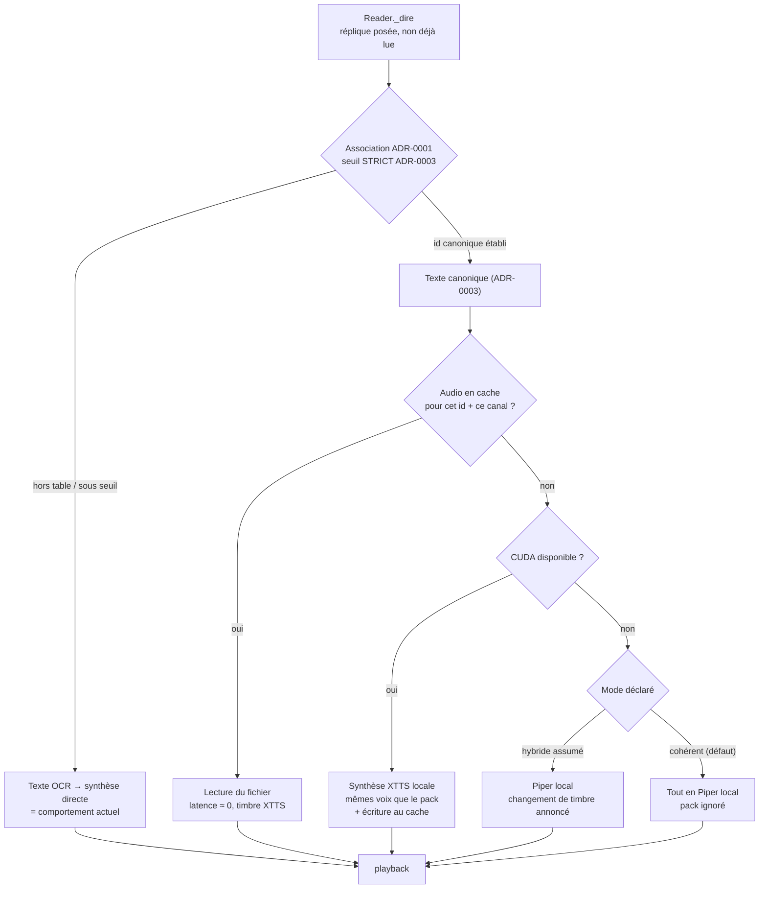

# ADR-0004 — Audio précompilé : la synthèse sort du temps de jeu

- **Statut** : Proposé — **volet 3 (distribution) à redécider** (CGU lues le
  2026-08-10) ; volets 1, 2 et 4 inchangés
- **Date** : 2026-08-03 (compléments du 2026-08-10 : CGU relevées, banc mesuré)

## Contexte et problème

L'ADR-0003 fait de l'OCR une clé d'index : quand l'association identifie la
réplique, c'est le **texte canonique** de la base qui part à la synthèse.
Le bruit d'OCR disparaît de la voix, la ponctuation est exacte, la latence
tombe d'une image.

Il reste alors une seule chose entre le texte et l'oreille : **le moteur de
synthèse, exécuté pendant que le joueur joue**. C'est lui qui impose les
trois compromis que le README assume aujourd'hui :

- **Le naturel plafonne à ce que le CPU peut tenir en direct.** Le timbre
  le plus naturel mesuré (XTTS-v2) exige CUDA — donc la carte graphique,
  qui appartient au jeu. Piper, le défaut, marque mal la ponctuation : le
  programme rajoute lui-même des pauses (`--pause`, 320 ms) pour compenser.
- **La synthèse coûte à chaque lecture**, même pour une réplique déjà
  entendue vingt fois. Un PNJ de zone de départ est relu à chaque
  personnage recommencé.
- **Le chargement du modèle** est payé au démarrage : 83 s pour XTTS,
  mesuré sur la machine de calibration.

Or, si le texte est canonique, il est **connu d'avance**. Une réplique
identifiée par son id n'a aucune raison d'être synthétisée au moment où on
la rencontre : elle pouvait l'être hier, ailleurs, sur une machine dont le
GPU n'était pas occupé par le jeu.

### Ce que pèse le corpus — mesuré, pas estimé

Relevé le 2026-08-03 sur l'API DofusDB, échantillon de 350 répliques tiré
sur toute la plage (`/npc-messages`, `$skip` de 0 à 54 000) :

| Grandeur | Valeur |
|---|---|
| Répliques uniques (`total` de l'API) | **55 037** |
| Longueur moyenne | **205,6 caractères** |
| Médiane | 181 caractères |
| p90 | 409 caractères |
| **Volume total de texte** | **≈ 11,3 M caractères** |

Converti en durée de parole via le banc XTTS du dépôt (Oto Mustam :
171 car. → 10,48 s d'audio, soit **16,3 car/s**) :

```
11,3 M car ÷ 16,3 car/s        ≈ 193 h d'audio
193 h × 0,24 (ratio XTTS 3070 Ti) ≈  46 h de GPU
```

**Ces chiffres corrigent une estimation antérieure d'un facteur 18.** Le
compte de 91 325 « ids de message » manipulé par
`outils/generer_table_genre.py` est un compte de *paires* d'identifiants,
avec doublons : les textes distincts sont 55 037. En sens inverse, la
réplique moyenne est 2,5× plus longue qu'estimé. Les deux erreurs ne se
compensaient pas. **Toute décision prise avant cette mesure est à
reconsidérer** — c'est le cas de celle-ci.

Poids sur disque, en Opus 24 kbps mono (largement suffisant pour de la voix
synthétique) :

```
193 h × 3 ko/s ≈ 2,1 Go
```

### Ce que ça coûte à louer

La tâche est **parallèle sans partage d'état** : 55 037 répliques
indépendantes. Huit machines pendant une heure coûtent exactement le prix
d'une machine pendant huit heures — on choisit la durée, pas le prix.

| Offre | $/h | Gain estimé vs 3070 Ti | Durée | Coût |
|---|---|---|---|---|
| Vast.ai / RunPod, RTX 4090 | ~0,35 | ~1,8× | ~26 h | **≈ 9 $** |
| RunPod, A100 80 Go | ~1,60 | ~2,5× | ~19 h | ≈ 30 $ |
| AWS `g6.xlarge` (L4) | 0,805 | ~1,2× | ~39 h | ≈ 31 $ |
| AWS `g5.xlarge` (A10G) | 1,006 | ~1,0× | ~46 h | ≈ 46 $ |
| AWS `p4d.24xlarge` (8×A100) | 32,77 | ~20× | ~2,4 h | ≈ 79 $ |

Les gains par carte sont **estimés** (XTTS suit à peu près la bande
passante mémoire) ; seul le ratio 0,24× de la 3070 Ti est mesuré. Un banc
d'une centaine de répliques sur la carte retenue précède la passe complète
— c'est la même discipline que l'ADR-0002 impose à tout nouveau moteur.

**Le calcul n'est donc pas l'obstacle.** À ~9 $ pour une nuit sur un loueur
GPU spécialisé, le pré-calcul complet est abordable. Ce qui reste à
trancher est ailleurs : *qui détient les fichiers produits*, et *ce qui se
passe quand le jeu change*.

## Décision

**Précompiler l'audio des répliques identifiées, avec XTTS-v2, hors du
temps de jeu ; au runtime, lire le fichier quand il existe et synthétiser
en direct sinon.**

Quatre règles la cadrent.

### 1. La clé est l'id canonique, jamais le texte OCRisé

Le cache est indexé par l'identifiant de message de la base
(`/npc-messages/<id>`), pas par une empreinte du texte lu à l'écran.
L'appariement flou est **déjà fait en amont** par l'association de
l'ADR-0001 (jetons `word_gap`, seuil + marge) ; le refaire sur l'audio
ajouterait un second point de défaillance sans rien apporter.

Conséquence directe : **pas de cache sans association sûre**. Une réplique
hors table, ou sous le seuil, n'a pas de clé — elle part en synthèse
directe, exactement comme aujourd'hui. Le seuil de substitution audio est
celui de l'ADR-0003 (le strict), pas celui du choix de voix.

### 2. Mise à jour incrémentale par empreinte de texte

Le pack ne se régénère jamais en entier après la première passe. À chaque
re-scrape, pour chaque id, on compare une **empreinte du texte français**
(hash stable, stocké à côté de l'audio dans le manifeste) :

| État constaté | Action |
|---|---|
| id absent du manifeste | synthétiser — réplique nouvelle |
| empreinte différente | re-synthétiser — Ankama a corrigé le texte |
| empreinte identique | ne rien faire |
| id disparu de l'API | conserver l'audio, marquer « orphelin » |

Une mise à jour de contenu Dofus touche typiquement quelques centaines de
répliques sur 55 037 : **quelques minutes de GPU**, pas 46 heures. C'est
cette mécanique qui rend le pré-calcul soutenable dans la durée — sans
elle, chaque patch du jeu rouvrirait le chantier entier.

L'empreinte porte sur le **texte source**, pas sur l'audio : c'est le texte
qui décide si l'audio est périmé. On ne conserve pas les textes en clair
dans le manifeste (même raison qu'à l'ADR-0001 : un index de faits, pas une
copie de contenu) — l'empreinte suffit à la comparaison.

Les orphelins sont conservés plutôt que supprimés : un id retiré de l'API
peut réapparaître, et l'espace en jeu est marginal. Une commande de purge
explicite reste disponible.

### 3. Le pack est distribué — et c'est le point à assumer

> **À REDÉCIDER — lecture des CGU du 2026-08-10.** Cette section évaluait le
> risque sur PolyForm NC et l'anonymat du mainteneur, sans avoir lu les CGU
> d'Ankama. Elles l'ont été depuis (version d'août 2025), et ce qu'elles
> disent est reporté en fin de section : les articles cités pèsent
> nettement plus lourd que ce que la §3 supposait. **Le statut du volet 3
> est donc rouvert, pas tranché ici** — la décision revient au mainteneur.
> Les volets 1, 2 et 4 ne dépendent pas de son issue.

La décision retenue est de **produire le pack une fois sur GPU loué et de
le distribuer**, plutôt que de faire générer chaque installation.

Ce qui la motive : un joueur sans carte NVIDIA n'a **aucun** chemin vers le
timbre XTTS. Le cache local paresseux ne le lui donne pas — il ne ferait
que mémoriser ce que son CPU produit déjà. La distribution est la seule
forme qui apporte le naturel à qui n'a pas le matériel, c'est-à-dire
précisément le public de l'exécutable autonome.

**Le risque, énoncé sans le minimiser.** Le pack contient les 11,3 M
caractères de dialogues d'Ankama sous forme directement écoutable. Ce n'est
pas un index, ce n'est pas une empreinte : c'est le contenu narratif du jeu
en œuvre dérivée consommable. L'ADR-0003 refuse déjà d'embarquer les
*textes* en clair pour cette raison (« redistribuer les dialogues du jeu ≠
redistribuer des empreintes ») ; l'audio va un cran plus loin. La licence
PolyForm Noncommercial et l'anonymat du mainteneur protègent contre l'usage
commercial et l'exposition personnelle — **ni l'un ni l'autre ne protège le
dépôt d'une demande de retrait**.

Cette ADR ne tranche pas cette question juridique : elle la **consigne
comme acceptée en connaissance de cause**, et rend la décision réversible.

**Ce qui suit ne tranche pas davantage — c'est le relevé de ce que dit le
texte, que la section ci-dessus n'avait pas consulté.**

#### Ce que disent les CGU (lues le 2026-08-10, version d'août 2025)

Trois articles portent sur le pack. Ils n'étaient pas cités ci-dessus.

**Art. 13.1** — la liste des éléments protégés nomme explicitement
**« dialogue »**, et aussi « son », « composition musicale », « effet
audiovisuel », « transcription de conversation dans les Jeux ». Ils « ne
peuvent faire l'objet d'**aucune utilisation** sans l'autorisation
préalable et écrite d'Ankama ».

**Art. 13.2** — interdiction « en tout ou partie, de **copier, reproduire,
traduire, extraire**, […] **distribuer ou créer des œuvres dérivées**
inspirées des Jeux ou du contenu sans l'accord écrit préalable ». Le pack
est les quatre à la fois : extraction, reproduction, œuvre dérivée,
distribution.

**Art. 13.5 — le verrou que l'analyse d'origine ignorait.** Ankama exerce
son droit d'opposition à la fouille de textes et de données (art.
L. 122-5-3 CPI) : les opérations de moissonnage « y compris par des
dispositifs de collecte automatisée de données, **constituent donc des
actes de contrefaçon** sauf accord spécifique formellement exprimé ».
Réservation lisible par machine : `TDM-RESERVATION: 1`.

**Art. 16.6** : l'article 13 **survit à la résiliation** du compte.

#### En quoi cela déplace les prémisses de la §3

- **PolyForm NC ne répond pas à l'article 13.** Celui-ci n'est pas
  conditionné au caractère commercial : il exige une autorisation écrite.
  La licence non-commerciale répond à l'art. 5.2.7 (« ne pas exploiter les
  Jeux à des fins commerciales »). La §3 s'appuyait sur la première pour
  couvrir un risque relevant du second.
- **Le risque envisagé était « une demande de retrait ».** L'art. 13.5
  qualifie la collecte de **contrefaçon** — registre différent.
- **Une nuance en sens inverse, à ne pas perdre** : l'art. 13.5 vise « le
  Site et le Launcher ». Les outils du dépôt frappent `api.dofusdb.fr`,
  base communautaire tierce, et non un service Ankama — le scrape ne
  heurte donc pas frontalement 13.5. Le *contenu* obtenu reste toutefois
  couvert par 13.1/13.2 quelle que soit sa provenance, DofusDB ne pouvant
  concéder des droits qu'il ne détient pas.

#### Ce que cela implique pour la suite

Trancher le volet 3 dans un sens ou dans l'autre appartient au mainteneur.
Deux remarques factuelles pour cette décision :

- Le repli *pack privé* documenté plus bas (génération et usage locaux,
  jamais de distribution) **est déjà la forme effective** de ce qui a été
  livré le 2026-08-10 : le dépôt porte les générateurs, leur sortie est un
  artefact local que le `.gitignore` exclut. Aucun code de runtime ne
  dépend de ce choix — l'ADR l'avait prévu, c'est vérifié.
- Ouvrir la distribution supposerait de traiter l'exigence d'accord écrit
  des art. 13.1/13.2, indépendamment de la question du caractère
  commercial.

**Second verrou, indépendant du premier** : XTTS-v2 est sous *Coqui Public
Model License*, qui restreint l'usage — y compris celui des sorties audio —
au non-commercial. Compatible avec PolyForm NC, mais à vérifier
explicitement avant distribution, et à citer dans le manifeste du pack. Si
la CPML interdisait la redistribution des sorties, le volet 3 tombe seul et
les volets 1, 2, 4 restent valides.

**Ce qui est distribué, précisément** : un pack versionné, téléchargé par
l'utilisateur à l'installation — au même titre que les voix Piper et le
modèle XTTS aujourd'hui. Le dépôt ne contient **ni l'audio, ni le script
d'hébergement** : il contient le générateur. La distribution est un geste
du mainteneur, pas un contenu du dépôt.

**Replis documentés d'avance**, à activer sans rouvrir l'analyse :

- *Pack privé* — génération et usage restreints au mainteneur et à ses
  proches ; le dépôt public ne porte que le générateur. Coût : les autres
  joueurs restent au timbre local.
- *Cache local paresseux* — chaque installation remplit son cache à
  l'usage, avec son propre moteur. Zéro distribution, zéro risque, mais
  aucun accès au timbre XTTS sans GPU.

Le passage de l'un à l'autre ne change **aucun code de runtime** : seule
change la provenance des fichiers. C'est la propriété qui rend la décision
réversible, et c'est pour l'obtenir que la §4 impose un timbre unique.

### 4. Un seul timbre par canal, quelle que soit la provenance

Substituer du texte est invisible ; **substituer de l'audio ne l'est pas**.
Si le cache sonne XTTS et le direct sonne Piper, le joueur entend la voix
changer à chaque réplique non couverte — et ce changement *signale une
défaillance* au lieu de la masquer.

Règle : sur une même installation, un canal de voix (au sens de
l'ADR-0001 : `pnj_masculin`, `pnj_feminin`, `narration`) rend **un seul
timbre**. Deux conséquences opérationnelles :

- Le pack déclare les voix XTTS employées par canal. Une installation qui
  utilise le pack et dispose de CUDA synthétise ses manques **avec les
  mêmes voix** — continuité parfaite.
- Une installation **sans** CUDA ne peut pas produire du XTTS. Elle a deux
  comportements admissibles, et l'ADR **exige que le choix soit explicite
  et affiché**, jamais silencieux :
  - *cohérent* — ignorer le pack, tout lire en Piper local ;
  - *hybride assumé* — lire le pack, combler en Piper, en ayant prévenu
    l'utilisateur au démarrage que les répliques hors pack changeront de
    voix.

Le défaut est **cohérent**. Un rendu homogène moins naturel vaut mieux
qu'un rendu qui trahit ses trous : c'est la même logique que l'abstention
par défaut de l'ADR-0001.

### Le chemin d'une réplique, d'un coup d'œil



Deux invariants s'y lisent, hérités des ADR précédentes : **toute sortie
incertaine retombe sur le comportement d'aujourd'hui**, et **la décision
est prise une fois par réplique**, à `_dire`, jamais par image.

## Options étudiées

| Option | Sort | Pourquoi |
|---|---|---|
| Statu quo — synthèse en direct systématique | Conservée comme repli permanent | C'est le chemin hors association, hors cache, hors CUDA. Le précompilé s'y superpose, il ne le remplace pas |
| Pré-calcul complet sur GPU loué, pack distribué | **Retenue** | ~9 $ et une nuit sur RTX 4090 louée ; seule forme qui donne le timbre XTTS à qui n'a pas de carte NVIDIA. Risque de redistribution assumé et consigné |
| Cache local paresseux, rempli à l'usage | Écartée — gardée comme repli | Zéro coût, zéro risque juridique, mais n'apporte **aucun** naturel supplémentaire : le cache ne peut contenir que ce que la machine sait déjà produire. Résout la latence, pas le timbre |
| Pré-calcul complet **chez l'utilisateur** | Rejetée | 26 à 46 h de GPU sur la machine du joueur ; ce n'est pas une commande d'installation, c'est un chantier. Et exige la carte que l'option cherchait à contourner |
| Pré-calcul d'un sous-ensemble (quêtes principales, zones de départ) | Rejetée | Fabrique un critère de sélection à définir et à maintenir, pour économiser un coût déjà négligeable (~9 $). Complexité sans contrepartie |
| Invalider tout le cache à chaque version du jeu | Rejetée | Jette 2,1 Go et des dizaines d'heures pour quelques dizaines de lignes modifiées. L'empreinte par id (§2) coûte quelques octets et fait mieux |
| Cache indexé par empreinte du texte **OCRisé** | Rejetée | Dédouble l'appariement flou déjà fait par l'ADR-0001 et ajoute un second point de défaillance. L'id canonique est disponible et exact |
| Corriger/normaliser l'audio en direct (pitch, débit) pour masquer l'écart de timbre | Rejetée | Le README écarte déjà le pitch-shift pour la féminisation (rendu mauvais) ; la raison vaut ici. La §4 traite le vrai besoin |

## Critères d'acceptation

- **Zéro audio erroné.** Un fichier joué doit correspondre exactement à la
  réplique affichée. Une seule erreur constatée ⇒ seuil d'association
  resserré, jamais l'inverse — même discipline qu'aux ADR-0001 et 0003.
- **Continuité de timbre vérifiable** : sur une session de test couvrant
  des répliques dans et hors pack, aucun changement de voix inattendu en
  mode *cohérent*. En mode *hybride*, l'avertissement de démarrage est
  présent.
- **Latence mesurée** (`QR_DEBUG`, comme les mesures existantes) : première
  voix sur réplique en cache, comparée au chemin de synthèse directe.
  L'écart attendu est le temps de synthèse complet.
- **Repli bit-à-bit** : pack absent ⇒ la suite de tests actuelle passe
  inchangée et le comportement en jeu est celui d'aujourd'hui.
- **Incrémental prouvé** : deux re-scrapes consécutifs sans mise à jour du
  jeu ⇒ **zéro** synthèse déclenchée. Un texte modifié à la main dans le
  manifeste ⇒ exactement une re-synthèse.
- **Banc sur la carte louée** avant la passe complète : une centaine de
  répliques, ratio mesuré, extrapolation vérifiée à ±20 % avant d'engager
  les 26 à 46 heures.

## Conséquences

- Un **générateur de pack** rejoint `outils/`, à côté de
  `generer_table_genre.py` : même discipline (hors ligne, hors CI, hors
  runtime, cadence polie, provenance datée), même source vérifiée.
- Un **manifeste versionné** accompagne le pack : id → empreinte du texte,
  voix employée par canal, date, version du jeu, moteur et version du
  modèle. C'est lui que la mise à jour incrémentale lit.
- `Speaker` gagne un chemin de lecture de fichier en amont de la synthèse ;
  `playback` reçoit un flux déjà encodé au lieu d'un tableau de PCM
  (décodage Opus à prévoir — dépendance à peser).
- Le README documente le téléchargement du pack au même endroit que les
  voix Piper et le modèle XTTS, avec sa provenance et sa date.
- **Dépend** de l'ADR-0003 (le texte canonique et son id sont la clé) et,
  par transitivité, de l'ADR-0001 (l'association). Sans elles, cette ADR
  n'a pas de clé de cache et ne peut pas exister.
- **Orthogonale** à l'ADR-0002 : le pack fixe les voix XTTS employées, la
  question du catalogue CPU reste entière pour tout ce qui est hors pack.

## Hors périmètre

- **Les réponses du joueur** (jamais lues) et le nom du PNJ.
- **Les autres langues** que le français. L'API porte `de`, `en`, `es`,
  `fr`, `pt` (vérifié le 2026-08-03) : le pack multilingue multiplierait le
  coût par cinq pour un besoin non exprimé.
- **Le clonage de voix** par PNJ individuel : 6 097 PNJ, aucun échantillon
  de référence, et le jeu n'est pas doublé. Les canaux de l'ADR-0001
  suffisent.
- **Toute correction du texte** avant synthèse — fautes d'Ankama comprises.
  On lit ce que le jeu affiche (règle héritée de l'ADR-0003).
- **L'hébergement du pack** (où, sous quelle forme, avec quelle
  vérification d'intégrité) : geste de distribution du mainteneur, à
  décider hors du dépôt.

## Références

- ADR-0003, « Lecture par texte canonique » — fournit l'id canonique qui
  sert de clé, et les seuils stricts de substitution.
- ADR-0001, « Mécanique d'association (signal 3) » — chaîne de données
  vérifiée, et le principe d'abstention par défaut repris ici.
- ADR-0002 — banc d'essai chiffré pour tout moteur, appliqué ici à la carte
  louée avant la passe complète.
- `plans/moteur-xtts-et-genre.md` — banc XTTS mesuré sur RTX 3070 Ti :
  ratio 0,24×, 1,96 Go de VRAM au pic, 83 s de chargement. **Le chargement
  re-mesuré le 2026-08-10 tombe à 13,6 s** (modèle déjà en cache disque, GPU
  libre) : les 83 s étaient un premier démarrage, téléchargement compris.
  Sans effet sur la passe complète — payé une fois — mais l'argument du
  « chargement coûteux » de la section « Contexte » en est affaibli.
- `api.dofusdb.fr/npc-messages` — mesuré le 2026-08-03 : `total` = 55 037,
  texte sous `message.fr`, longueur moyenne 205,6 car. sur 350 relevés,
  langues `de`/`en`/`es`/`fr`/`pt`.
- `outils/generer_table_genre.py` — le générateur dont celui du pack reprend
  la discipline (et dont les « 91 325 ids » sont des paires, pas des textes
  distincts).
- **CGU d'Ankama, version d'août 2025 — lues intégralement le 2026-08-10**
  (`https://www.dofus.com/fr/cgu`, inaccessible aux agents : 403 puis 302
  vers un flux d'authentification ; copie fournie par le mainteneur). Art.
  13.1 (« dialogue » nommément protégé), 13.2 (copier / reproduire /
  extraire / distribuer / œuvres dérivées interdits sans accord écrit),
  13.5 (opposition TDM, moissonnage = contrefaçon, `TDM-RESERVATION: 1`),
  5.2.7 (usage non commercial) et 16.6 (l'art. 13 survit à la résiliation).
  **C'est cette lecture qui rouvre le volet 3.**
- Coqui Public Model License (XTTS-v2) — restait à vérifier avant
  distribution ; sans objet tant que le pack n'est pas distribué.
- `outils/banc_precompilation.py` — **banc du 2026-08-10 sur RTX 3070 Ti
  libre, échantillon stratifié en longueur** (300 répliques, moyenne
  268 car. contre 205,6 au corpus : pondéré vers les longues, donc
  conservateur). Résultat : **ratio 0,229×** (médian 0,226×) contre 0,24×
  annoncé, débit 16,1 car/s contre 16,3, coût fixe par appel 0,176 s.
  Extrapolation **44,8 h** par le ratio, **45,4 h** par le modèle affine
  (fixe + pente × caractères) — l'écart de 1 % entre les deux montre que le
  coût fixe ne domine pas, et l'ADR annonçait 46 h : **validée bien en deçà
  des ±20 % exigés**. Les heures scalent linéairement avec le volume total
  de caractères, lui-même estimé sur 350 relevés — c'est de cette estimation
  que l'extrapolation hérite son incertitude, pas du ratio.
  Le ratio croît légèrement avec la longueur (0,213× sous 80 caractères,
  0,235× au-dessus de 450) : les répliques courtes portent
  proportionnellement plus de silence de début et de fin.
- **Chemin découpé re-mesuré séparément** — le banc appelle le moteur une
  fois par réplique, le générateur une fois par *phrase* (voir §
  « découpage »). Le coût fixe de 0,176 s par appel se paie alors N fois, et
  les segments courts portent plus de silence : les deux effets pouvaient
  gonfler la passe. Comparé sur **40 ids identiques** (148 appels pour 40
  répliques, 3,7 phrases par réplique) : ratio **0,233×** contre 0,230×,
  débit 16,4 contre 16,6 car/s, soit **+2,6 % de synthèse** et **+1,3 %
  d'audio** — passe complète **44,7 h** contre 43,6 h. Le surcoût du
  découpage est donc réel mais marginal : le coût fixe est un intercept de
  régression, pas un péage payé plein à chaque appel. **C'est 0,233× /
  16,4 car/s que le générateur utilise pour ses estimations**, pas les
  valeurs du banc.
- Compression mesurée le 2026-08-10 (ffmpeg, 24 kHz mono) : WAV 16 bits
  46,9 ko/s, Opus 24 kbps 4,6 ko/s, **facteur 10,1×**. Sur 193 h d'audio :
  **33,4 Go en WAV, 3,3 Go en Opus** — l'estimation de 2,1 Go de la section
  « Ce que pèse le corpus » supposait 3 ko/s et est optimiste d'environ
  57 %. Le générateur écrit du WAV : l'encodage Opus reste à faire.
- README, « Licence » (PolyForm Noncommercial 1.0.0) et « Kéraconte est un
  outil non officiel, sans lien avec Ankama ».
